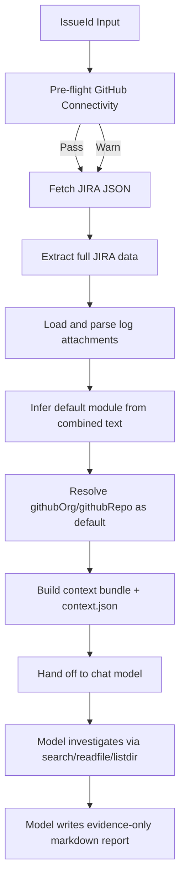

# JIRA Root Cause Agent - Design Document

## 1. Purpose

This document defines the design of the JIRA Root Cause Agent so developers can safely enhance it.

The system takes a JIRA issue key, gathers full issue context, maps the issue to a default GitHub repository, and hands off to the chat model, which investigates the code and emits evidence-bound analysis artifacts. The agent is issue-type and language agnostic; it is not specialized for any single failure class.

## 2. Goals and Non-Goals

### Goals

- Deterministic end-to-end flow from IssueId to output artifacts.
- Strict evidence-first analysis with explicit gaps.
- No dependency on local source checkout for repository analysis.
- Safe extension points for module mapping, evidence parsing, and report generation.

### Non-Goals

- Automatic patch creation or auto-commit to source repositories.
- Runtime execution of product binaries or reproducer automation.
- Accessing external systems beyond JIRA and GitHub Enterprise APIs.

## 3. System Context

Inputs:
- Required: IssueId.
- Required credentials: JIRA token and GitHub token.
- Configuration: module-to-repo map.

Outputs:
- Raw JIRA payload.
- Context bundle for the chat model.
- Final markdown analysis report (written by the model).
- Context metadata for downstream tooling.

Primary scripts:
- Scripts/fetch-jira.ps1
- Scripts/invoke-jira-rootcause.ps1
- Scripts/_syntax-check.ps1

Primary configuration:
- config/module-repo-map.json
- config/jira-creds.json.example
- config/jira-creds.json (local fallback, gitignored)

## 4. High-Level Architecture

Design invariants:
- GitHub connectivity is checked before JIRA fetch; a failure prints a warning (it does not abort the run), so JIRA context is still gathered while the code-access actions remain unusable until connectivity/auth is fixed.
- The script gathers context and exposes code-access tools; it does NOT itself perform LLM reasoning, evidence classification, or analysis. All investigation and synthesis is done by the chat model.
- The agent is issue-type and language agnostic. It is not specialized for any single failure class.

## 5. Runtime Flow (Detailed)

### Step 0: Configuration and pre-flight

Implementation owner: Scripts/invoke-jira-rootcause.ps1

- Load module map.
- Resolve GitHub org and base URL.
- Resolve GitHub token from credential chain.
- Verify GitHub API reachability and auth.
- Warn (do not abort) on auth/network failure; abort only on configuration errors such as a missing/placeholder githubOrg.

Why this order:
- Surface repo-access problems early so the analyst knows the code-access actions may fail, while still gathering JIRA context.

### Step 1: JIRA fetch

Implementation owner: Scripts/fetch-jira.ps1

- Authenticate using bearer or basic auth fallback.
- Fetch issue JSON from JIRA REST API.
- Persist output/<KEY>/<KEY>.json.
- Discover and selectively download log-like attachments.
- Skip logs uploaded by the assignee to reduce post-investigation noise.
- Persist output/<KEY>/attachments-manifest.json.

### Step 2: Data extraction and corpus build

Implementation owner: Scripts/invoke-jira-rootcause.ps1

- Parse all core issue fields.
- Flatten description/comments/environment into analysis corpus.
- Read downloaded logs, including .gz support.
- Merge issue text + accepted attachment text.

### Step 3: Module inference and repo resolution

- Score each module in config/module-repo-map.json by token matches.
- Choose highest-scoring module.
- Resolve target repository as githubOrg/githubRepo.
- Abort if module has no githubRepo.

#### Step 3a: Repository selection scope (does it search all repos?)

Short answer: no. The agent does **not** scan every repository in the map at
once. It selects a single repository per operation, while keeping the full map
available so the analyst (or chat model) can pivot to any other repo on demand.

How repository selection works:

- `Resolve-Module` reads the combined JIRA text (summary + description +
  comments + environment + accepted attachment logs) and scores **each** module
  in the map by counting how many of that module's `match` keywords appear in
  the text.
- The single highest-scoring module wins and becomes the **default repository**
  (`githubOrg/githubRepo`). This is treated as a hint only, not a hard binding.
  If no keyword matches, the agent falls back to the first module listed in the
  map as the default.
- All other modules in the map are still loaded and exposed. During the
  `analyze` action, the context bundle (`output/<KEY>/context-bundle.md`) and
  `context.json` list **every** configured repository under
  `availableRepos`, alongside its keywords, so the model can override the
  inferred default.

How investigation actually queries repositories:

- Each `search`, `readfile`, and `listdir` action targets exactly **one**
  repository, resolved by `Resolve-RepoName`: an explicit `-Repo` argument wins;
  otherwise the inferred default repo is used.
- The GitHub code search is scoped with `repo:<org>/<repo>`, so a single call
  never spans multiple repositories.
- To investigate multiple components, the analyst issues multiple per-repo calls
  (one `-Repo` each). There is no single command that fans out across the whole
  map; multi-repo coverage is achieved by repeated, explicit, per-repo
  invocations.
- `Action listrepos` prints the full configured map (all repos, keywords, and
  the current default) to help choose which repository to query next.

Implication: the map is a routing table, not a search surface. Inference narrows
to one default repo for convenience, but the full list remains available so the
model can deliberately broaden the investigation one repository at a time.

### Step 4: Context bundle generation and hand-off

Implementation owner: Scripts/invoke-jira-rootcause.ps1 (`Build-ContextBundle`, `Invoke-AnalyzeAction`)

- Assemble a human- and model-readable context bundle from the gathered data:
  fields, inferred default component, the full list of available repositories,
  description, comments, linked issues, and accepted attachment log excerpts.
- Write output/<KEY>/context-bundle.md and output/<KEY>/context.json.
- Hand off to the chat model. The script performs no evidence parsing,
  classification, query generation, or source scanning of its own.

Important: the agent is **issue-type agnostic**. It does NOT pre-classify the
problem into any single category. Raw
JIRA text and logs are passed through verbatim so the model can diagnose any
kind of issue (functional bug, build failure, config error, performance problem,
etc.) in any language. The script applies no rule-based classification
heuristics of its own.

### Step 5: Model-driven investigation

Implementation owner: the chat model, using the script's code-access actions.

- The model forms a hypothesis from the context bundle.
- It investigates the real code through the script's tool actions, scoped to a
  chosen repository (default inferred repo, or any other via `-Repo`):
  - `search`   - GitHub code search within one repo.
  - `readfile` - numbered slice (or whole file) of a repo source file, cached.
  - `listdir`  - list a repo directory.
- Query terms, file choices, and the depth of investigation are decided by the
  model based on the specific issue, not by fixed evidence heuristics.

### Step 6: Evidence collection

- Code-access actions return real repository content (search hits, file slices,
  directory listings) that the model reads directly.
- Each file is fetched from GitHub once and served from an on-disk cache for
  subsequent reads, so the model can re-inspect ranges without extra calls.

### Step 7: Analysis synthesis

- The model writes an evidence-only report, typically covering:
  - Problem
  - Evidence (from JIRA text, logs, and code actually read)
  - JIRA comments and attachments
  - Repository findings
  - Root cause
  - Repro steps
  - Suggested fix
  - Known gaps
- Report is written to output/<KEY>/<KEY>-analysis.md.
- The exact sections adapt to the issue type rather than a fixed template.

## 6. Data Contracts

### 6.1 Module map schema (config/module-repo-map.json)

Top-level:
- githubOrg: string
- githubBaseUrl: string (GitHub Enterprise API base)
- modules: array

Per module:
- name: string
- match: string[] (lowercase keyword tokens)
- githubRepo: string (required)
- repoRelativePath: optional legacy field, not used by core flow

Compatibility note:
- Existing modules include repoRelativePath; current runtime flow resolves repository using githubRepo.

### 6.2 Attachment manifest contract

File: output/<KEY>/attachments-manifest.json

Per entry includes:
- Filename
- Author
- MimeType
- Size
- IsLog
- Downloaded
- LocalPath
- SkippedReason

### 6.3 Context contract

File: output/<KEY>/context.json

Contains:
- issue metadata (issueId, summary, status, priority)
- inferredComponent, githubOrg, and resolved defaultRepo
- availableRepos (full list from the module map)
- commentCount, attachmentCount, linkedIssueCount
- logAttachmentsIncluded
- generated artifact paths (jsonPath, contextBundlePath, analysisPath)

Note: fields such as crash evidence summary, queriesRun, sourceFilesFetched, and
nullDerefCandidates are not part of the current context.json contract.

## 7. Credential and Secret Resolution

JIRA credentials (fetch-jira.ps1):
1. JIRA_CREDS_FILE path
2. $HOME/.jira-agent/jira-rootcause-creds.json
3. config/jira-creds.json
4. process env vars
5. user env vars

GitHub credentials (invoke-jira-rootcause.ps1):
1. JIRA_CREDS_FILE path (if contains GITHUB_TOKEN)
2. $HOME/.jira-agent/jira-rootcause-creds.json
3. config/jira-creds.json
4. GITHUB_TOKEN process env var
5. GITHUB_TOKEN user env var

Security expectations:
- Never commit real credentials.
- Keep canonical credential file outside repository.

## 8. Extension Points and How to Modify

### A. Add or improve module routing

Where:
- config/module-repo-map.json
- Resolve-Module function in Scripts/invoke-jira-rootcause.ps1

Safe changes:
- Add tokens to match arrays.
- Add new module entries.
- Improve scoring logic while preserving deterministic output and top-score winner behavior.

### B. Adjust the context bundle

Where:
- Build-ContextBundle in Scripts/invoke-jira-rootcause.ps1

Safe changes:
- Add fields or sections surfaced to the chat model.
- Adjust how attachments, comments, or available repositories are presented.
- Keep the bundle issue-type agnostic; do not pre-classify the problem.

### C. Adjust the code-access actions

Where:
- Invoke-SearchAction / Invoke-ReadFileAction / Invoke-ListDirAction in Scripts/invoke-jira-rootcause.ps1

Safe changes:
- Tune result limits, caching, or output formatting.
- Add new read-only repository actions the model can call.
- Keep each action scoped to a single repository.

## 9. Error Handling and Abort Semantics

Hard-stop errors:
- githubOrg missing or placeholder.
- Missing target githubRepo for inferred module.
- Missing JIRA auth.

Recoverable warnings:
- GitHub pre-flight unreachable/unauthorized/forbidden (run continues; code-access actions will fail until fixed).
- No module keyword match (fallback to first/default repo).
- Attachment download/read failures.
- Individual code-access action failures (search/readfile/listdir).

Design principle:
- Fail fast for foundational dependencies.
- Degrade gracefully for optional enrichment steps.

## 10. Operational Characteristics

Current API behavior:
- Code search is rate-limited via per-query delay.
- Each repository file is fetched from GitHub once, then served from an on-disk cache.
- Attachment text size is capped to avoid parser overload.

Complexity hotspots:
- Module keyword scoring over combined JIRA text.
- GitHub Enterprise API reliability and rate limits.

## 11. Validation Strategy

Minimum validation after script edits:
1. Run Scripts/_syntax-check.ps1.
2. Run end-to-end on a known issue.
3. Verify context.json inferredComponent and defaultRepo correctness.
4. Verify context-bundle.md lists the available repositories and issue context.
5. Verify the model-written analysis markdown has no empty critical sections unless marked [EVIDENCE NEEDED].

Recommended additional checks:
- One issue with rich logs/attachments.
- One issue with only sparse text.
- One issue where no module should match, to validate fallback/default repo behavior.

## 12. Change Impact Matrix

- Changes in fetch-jira.ps1 impact authentication, attachment handling, and raw issue fidelity.
- Changes in Resolve-Module impact repository routing and the inferred default repo.
- Changes in Build-ContextBundle impact what the chat model sees and reasons over.
- Changes in Search-GitHubCode / readfile / listdir actions affect the model's ability to investigate code.

## 13. Known Limitations

- Module inference is keyword scoring, not semantic ownership detection.
- C/H source analysis is heuristic and may produce false positives/negatives.
- Search depth and fetched files are intentionally bounded to control API cost and latency.
- Reproducer steps are derived from issue evidence; they are not executed by the system.

## 14. Recommended Roadmap

Phase 1:
- Unit-test regex classifiers and query builders with fixture logs.
- Add a strict JSON schema validator for module-repo-map.json.

Phase 2:
- Introduce weighted module scoring with explainability in context.json.
- Add confidence scores to crash-type classification.

Phase 3:
- Add optional language-aware parser for C/C++ (AST-based) to reduce heuristic noise.
- Add machine-readable report format for integration into CI or issue dashboards.

## 15. Developer Quick Start for Enhancements

1. Read this document and CONTRIBUTING.md.
2. Identify extension point (routing, evidence, querying, analysis, reporting).
3. Make the smallest focused change.
4. Run syntax and one real issue flow.
5. Validate artifacts under output/<KEY>/.
6. Document behavior changes in README.md or CONTRIBUTING.md when user-facing.

## 16. Ownership Notes

Single-script concentration:
- Most core logic lives in Scripts/invoke-jira-rootcause.ps1.

Suggested maintainability direction:
- Split into function modules by concern (credentials, evidence parsing, github api, reporting) while preserving current CLI contract for backward compatibility.
