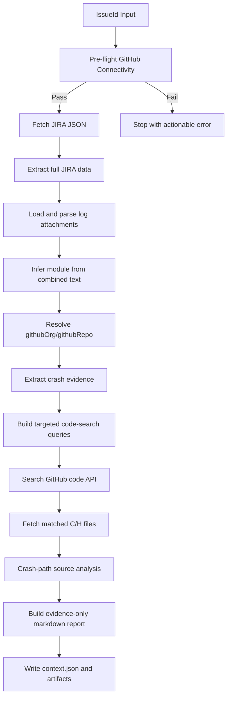

# JIRA Root Cause Agent - Design Document

## 1. Purpose

This document defines the design of the JIRA Root Cause Agent so developers can safely enhance it.

The system takes a JIRA issue key, gathers full issue context, maps the issue to a target GitHub repository, searches code with crash-aware queries, and emits evidence-bound analysis artifacts.

## 2. Goals and Non-Goals

### Goals

- Deterministic end-to-end flow from IssueId to output artifacts.
- Strict evidence-first analysis with explicit gaps.
- No dependency on local source checkout for repository analysis.
- Safe extension points for module mapping, evidence parsing, and report generation.

### Non-Goals

- Automatic patch creation or auto-commit to source repositories.
- Runtime execution of product binaries or kernel reproducer automation.
- Accessing external systems beyond JIRA and GitHub Enterprise APIs.

## 3. System Context

Inputs:
- Required: IssueId.
- Required credentials: JIRA token and GitHub token.
- Configuration: module-to-repo map.

Outputs:
- Raw JIRA payload.
- Repository search evidence.
- Optional source-level crash-path analysis.
- Final markdown analysis report.
- Context metadata for downstream tooling.

Primary scripts:
- Scripts/fetch-jira.ps1
- Scripts/invoke-jira-rootcause.ps1
- Scripts/_syntax-check.ps1

Primary configuration:
- config/module-repo-map.json
- config/jira-creds.json.example
- config/jira-creds.json (local fallback, gitignored)

## 4. High-Level Architecture

Design invariant:
- GitHub connectivity is checked before JIRA fetch, and the run aborts immediately if GitHub is not reachable.

## 5. Runtime Flow (Detailed)

### Step 0: Configuration and pre-flight

Implementation owner: Scripts/invoke-jira-rootcause.ps1

- Load module map.
- Resolve GitHub org and base URL.
- Resolve GitHub token from credential chain.
- Verify GitHub API reachability and auth.
- Abort on configuration/auth/network errors.

Why this order:
- Prevent partial runs and false confidence when repo access is unavailable.

### Step 1: JIRA fetch

Implementation owner: Scripts/fetch-jira.ps1

- Authenticate using bearer or basic auth fallback.
- Fetch issue JSON from JIRA REST API.
- Persist output/<KEY>/<KEY>.json.
- Discover and selectively download log-like attachments.
- Skip logs uploaded by the assignee to reduce post-investigation noise.
- Persist output/<KEY>/attachments-manifest.json.

### Step 2: Data extraction and corpus build

Implementation owner: Scripts/invoke-jira-rootcause.ps1

- Parse all core issue fields.
- Flatten description/comments/environment into analysis corpus.
- Read downloaded logs, including .gz support.
- Merge issue text + accepted attachment text.

### Step 3: Module inference and repo resolution

- Score each module in config/module-repo-map.json by token matches.
- Choose highest-scoring module.
- Resolve target repository as githubOrg/githubRepo.
- Abort if module has no githubRepo.

### Step 4: Crash evidence extraction

- Parse for BUG/Oops markers, call-trace frames, function names, thread names, crash address, poison hints, error codes, and diagnostic log lines.
- Classify crash type using rule-based heuristics.

### Step 5: Search strategy generation

- Build labeled GitHub code-search queries from strongest evidence first:
  - thread names
  - trace function names
  - quoted log fragments
  - crash offset hints
  - bug keyword reductions
  - error codes
- Fallback to summary-derived tokens only when crash evidence is empty.

### Step 6: Repository evidence collection

- Execute each labeled query using GitHub Search API.
- Save grouped hits to output/<KEY>/repo-search.txt.
- Collect unique matched C/H file paths for deeper analysis.

### Step 7: Optional source-level analysis

- Fetch up to five matched source files from GitHub Contents/Blob APIs.
- Parse function boundaries.
- Score crash relevance by evidence token overlap.
- Detect candidate unchecked pointer dereferences.
- Emit output/<KEY>/code-analysis.json.

### Step 8: Analysis synthesis

- Generate evidence-only report:
  - Problem
  - Crash evidence
  - JIRA comments
  - Attachments
  - GitHub search results
  - Source code analysis
  - Root cause
  - Repro steps
  - Suggested fix
  - Known gaps
- Emit output/<KEY>/<KEY>-analysis.md.
- Emit output/<KEY>/context.json.

## 6. Data Contracts

### 6.1 Module map schema (config/module-repo-map.json)

Top-level:
- githubOrg: string
- githubBaseUrl: string (GitHub Enterprise API base)
- modules: array

Per module:
- name: string
- match: string[] (lowercase keyword tokens)
- githubRepo: string (required)
- repoRelativePath: optional legacy field, not used by core flow

Compatibility note:
- Existing modules include repoRelativePath; current runtime flow resolves repository using githubRepo.

### 6.2 Attachment manifest contract

File: output/<KEY>/attachments-manifest.json

Per entry includes:
- Filename
- Author
- MimeType
- Size
- IsLog
- Downloaded
- LocalPath
- SkippedReason

### 6.3 Context contract

File: output/<KEY>/context.json

Contains:
- issue metadata
- resolved module/repository
- crash evidence summary
- queriesRun
- sourceFilesFetched
- nullDerefCandidates
- generated artifact paths

## 7. Credential and Secret Resolution

JIRA credentials (fetch-jira.ps1):
1. JIRA_CREDS_FILE path
2. $HOME/.jira-agent/jira-rootcause-creds.json
3. config/jira-creds.json
4. process env vars
5. user env vars

GitHub credentials (invoke-jira-rootcause.ps1):
1. JIRA_CREDS_FILE path (if contains GITHUB_TOKEN)
2. $HOME/.jira-agent/jira-rootcause-creds.json
3. config/jira-creds.json
4. GITHUB_TOKEN process env var
5. GITHUB_TOKEN user env var

Security expectations:
- Never commit real credentials.
- Keep canonical credential file outside repository.

## 8. Extension Points and How to Modify

### A. Add or improve module routing

Where:
- config/module-repo-map.json
- Resolve-Module function in Scripts/invoke-jira-rootcause.ps1

Safe changes:
- Add tokens to match arrays.
- Add new module entries.
- Improve scoring logic while preserving deterministic output and top-score winner behavior.

### B. Improve crash signal extraction

Where:
- Get-CrashEvidence in Scripts/invoke-jira-rootcause.ps1

Safe changes:
- Add regex for new kernel signatures.
- Add richer crash-type classes.
- Preserve current fields in returned hashtable to keep report generation compatible.

### C. Improve query quality

Where:
- Get-CrashSearchQueries in Scripts/invoke-jira-rootcause.ps1

Safe changes:
- Add additional label classes.
- Tune prioritization limits.
- Keep labels stable and human-readable for debugging in repo-search.txt.

### D. Improve source-level heuristics

Where:
- Invoke-CrashCodeAnalysis in Scripts/invoke-jira-rootcause.ps1

Safe changes:
- Better function boundary parsing.
- Better dataflow/null-check heuristics.
- Keep output structure stable to avoid report breakage.

### E. Adjust report format

Where:
- Build-AnalysisReport in Scripts/invoke-jira-rootcause.ps1

Safe changes:
- Add sections and better evidence tables.
- Keep evidence-first stance and explicit [EVIDENCE NEEDED] gaps.

## 9. Error Handling and Abort Semantics

Hard-stop errors:
- githubOrg missing or placeholder.
- GitHub pre-flight unreachable/unauthorized/forbidden.
- Missing target githubRepo for inferred module.
- Missing JIRA auth.

Recoverable warnings:
- No crash-specific queries generated (fallback query path used).
- No C/H file matches found.
- Individual source file fetch failures.
- Attachment download/read failures.

Design principle:
- Fail fast for foundational dependencies.
- Degrade gracefully for optional enrichment steps.

## 10. Operational Characteristics

Current API behavior:
- Code search is rate-limited via per-query delay.
- Source file fetch is capped to first five unique matched C/H files.
- Attachment text size is capped to avoid parser overload.

Complexity hotspots:
- Regex-heavy parsing in crash extraction.
- Function boundary inference in C source analysis.

## 11. Validation Strategy

Minimum validation after script edits:
1. Run Scripts/_syntax-check.ps1.
2. Run end-to-end on a known issue.
3. Verify context.json module and repository correctness.
4. Verify repo-search.txt includes labeled query blocks.
5. Verify analysis markdown has no empty critical sections unless marked [EVIDENCE NEEDED].

Recommended additional checks:
- One issue with strong call trace evidence.
- One issue with only sparse logs.
- One issue where no module should match, to validate error path clarity.

## 12. Change Impact Matrix

- Changes in fetch-jira.ps1 impact authentication, attachment handling, and raw issue fidelity.
- Changes in Resolve-Module impact repository routing and all downstream evidence.
- Changes in Get-CrashEvidence impact query generation, root-cause classification, and report content.
- Changes in Search-GitHubCode affect evidence volume and API reliability.
- Changes in Build-AnalysisReport affect consumer readability and trust in outputs.

## 13. Known Limitations

- Module inference is keyword scoring, not semantic ownership detection.
- C/H source analysis is heuristic and may produce false positives/negatives.
- Search depth and fetched files are intentionally bounded to control API cost and latency.
- Reproducer steps are derived from issue evidence; they are not executed by the system.

## 14. Recommended Roadmap

Phase 1:
- Unit-test regex classifiers and query builders with fixture logs.
- Add a strict JSON schema validator for module-repo-map.json.

Phase 2:
- Introduce weighted module scoring with explainability in context.json.
- Add confidence scores to crash-type classification.

Phase 3:
- Add optional language-aware parser for C/C++ (AST-based) to reduce heuristic noise.
- Add machine-readable report format for integration into CI or issue dashboards.

## 15. Developer Quick Start for Enhancements

1. Read this document and CONTRIBUTING.md.
2. Identify extension point (routing, evidence, querying, analysis, reporting).
3. Make the smallest focused change.
4. Run syntax and one real issue flow.
5. Validate artifacts under output/<KEY>/.
6. Document behavior changes in README.md or CONTRIBUTING.md when user-facing.

## 16. Ownership Notes

Single-script concentration:
- Most core logic lives in Scripts/invoke-jira-rootcause.ps1.

Suggested maintainability direction:
- Split into function modules by concern (credentials, evidence parsing, github api, reporting) while preserving current CLI contract for backward compatibility.
